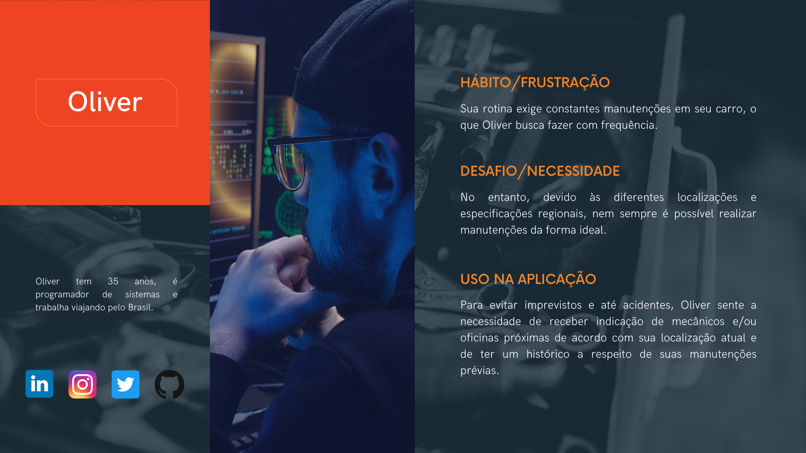
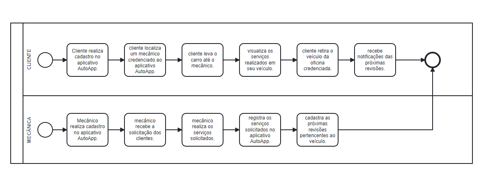
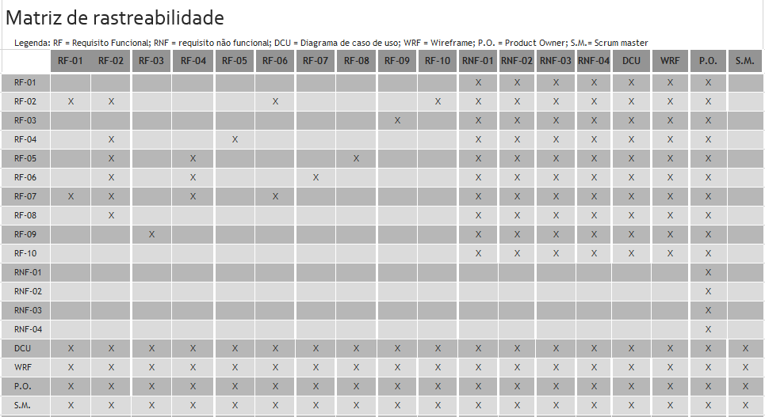
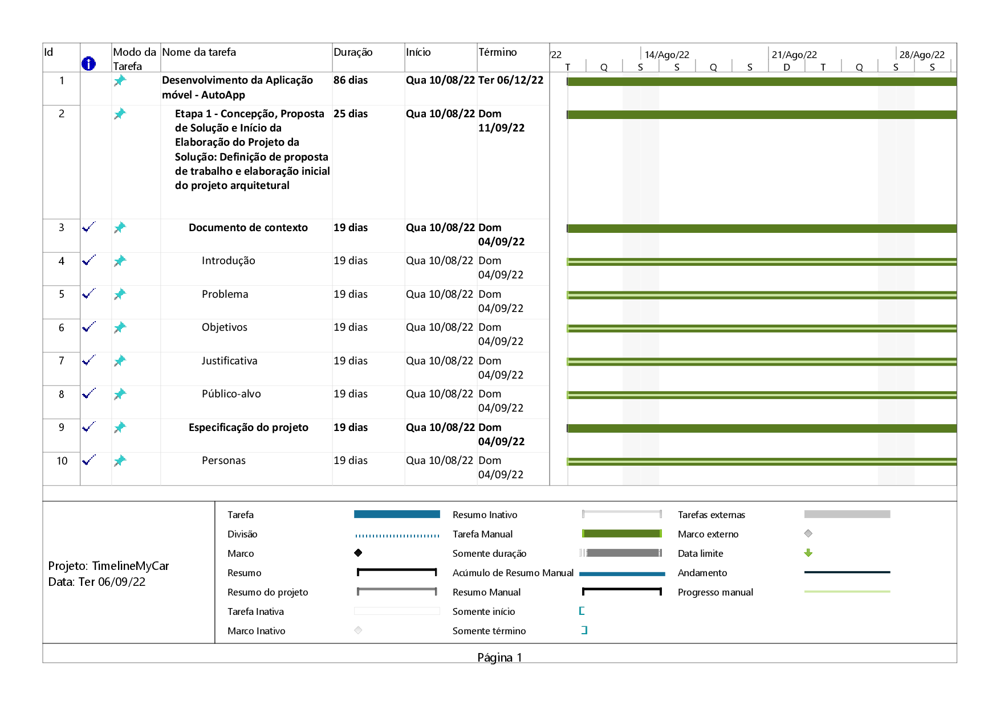
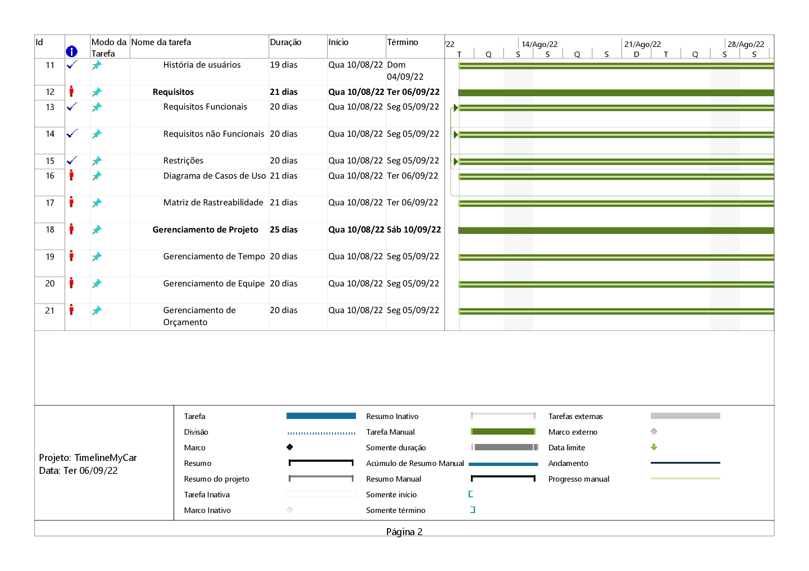
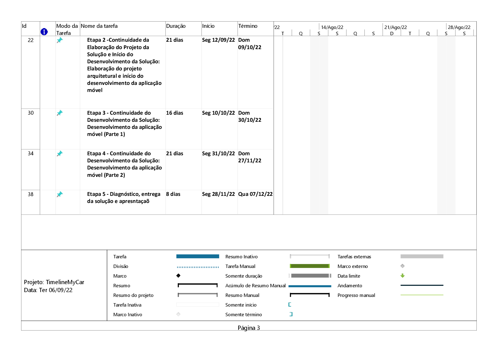
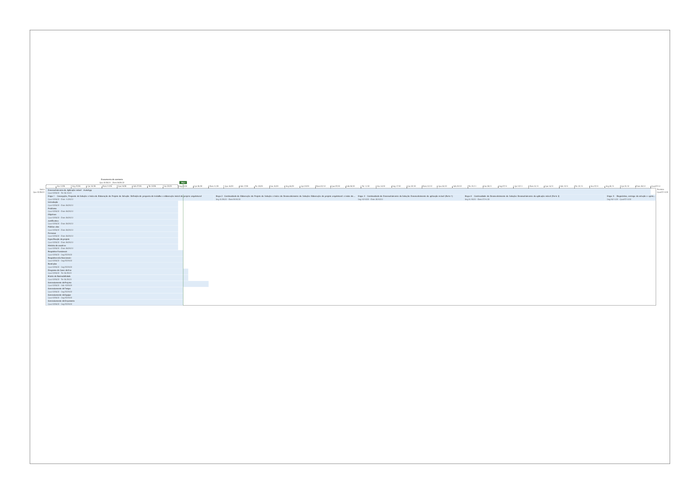
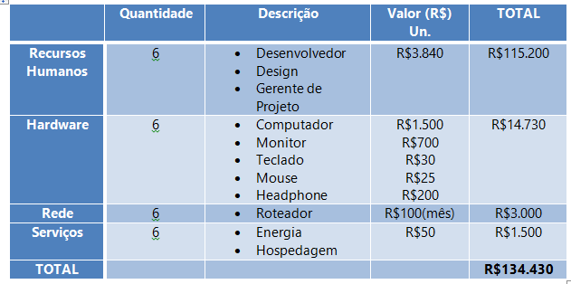

# Especificações do Projeto

Pré-requisitos: <a href="https://github.com/ICEI-PUC-Minas-PMV-ADS/AutoApp/blob/6e8341aac6887998ec783beca8ce97995d7e896a/docs/01-Documenta%C3%A7%C3%A3o%20de%20Contexto.md"> Documentação de Contexto</a>

Nesta seção, apresentamos o diagrama de personas, histórias de usuários, requisitos funcionais e não funcionais, além das restrições identificadas para o desenvolvimento deste projeto.

## Personas

Eleonor tem 27 anos, é escritora recém formada e acabou de se mudar para Recife. É conhecida por seus amigos como uma pessoa relativamente negligente em relação às tarefas que não são relacionadas à escrita, como a manutenção de sua moto. Em uma nova cidade, Eleonor espera construir novos hábitos saudáveis e um deles é se organizar para conseguir realizar as revisões e as devidas manutenções que seu veículo automotor necessita. Assim sendo, a escritora busca uma aplicação para que essa organização seja possível e para ter a segurança de que receberá alertas calculados de quando deve visitar um mecânico mais próximo de sua residência

Oliver tem 35 anos, é programador de sistemas e trabalha viajando pelo Brasil. Sua rotina exige constantes manutenções em seu carro, o que Oliver busca fazer com frequência. No entanto, devido às diferentes localizações e especificações regionais, nem sempre é possível realizar manutenções da forma ideal. Para evitar imprevistos e até acidentes, Oliver sente a necessidade de receber indicação de mecânicos e/ou oficinas próximas de acordo com sua localização atual e de ter um histórico a respeito de suas manutenções prévias.

Daniel tem 58 anos e é dono de uma oficina de carros e motos na região metropolitana de Belo Horizonte. Seu negócio é herdado de sua família, muito conhecido e bem avaliado pelos moradores de seu bairro. Entretanto, Daniel sente a necessidade de aumentar seu número de clientes. Busca, dessa forma, virtualizar a sua oficina e ter um alcance maior de clientes, para além da região metropolitana. 

William tem 47 anos, coleciona carros antigos e mora em Florianópolis. Tem o hábito de anotar, à mão, todas as modificações, manutenções e ajustes que faz de seus carros, além das características que tornam seus carros diferenciados. Com o passar dos anos, sentiu a necessidade de ter um melhor controle das manutenções realizadas como um melhor histórico de todas essas ações. Assim, busca um sistema que seja possível organizar os dados de seus carros. Com o objetivo de verificar a precedência de seus automóveis, William também busca uma forma ágil de consultar, de maneira segura e integrada com o DETRAN, pendências dos seus veículos recém adquiridos.

Theodora tem 38 anos, é professora no departamento de Engenharia Mecânica em uma universidade privada de São Paulo. Sua profissão a tornou, ao longo dos anos, uma pessoa entusiasta por carros esportivos. Todavia, Theodora não encontra oficinas e mecânicos especializados que sabem lidar com o modelo de seu carro. Busca, então, um meio de receber indicações de melhores e específicas oficinas para atender às especificidades de seu veículo.

## Histórias de Usuários

Com base na análise das personas, foram identificadas as seguintes histórias de usuários:

| EU COMO... `PERSONA`                      | QUERO/PRECISO ... `FUNCIONALIDADE`                  | PARA ... `MOTIVO/VALOR`                              |
| ----------------------------------------- | --------------------------------------------------- | ---------------------------------------------------- |
| Eu, Eleonor, como usuária do aplicativo,  | quero organizar as informações sobre a minha moto   | para ter uma estimativa de quando devo visitar um mecânico. |
| Eu, Oliver, como usuário do aplicativo,   | quero receber indicação de mecânicos e/ou oficinas  | para realizar manutenções e consertos em meu carro independentemente de minha localização atual. |
| Eu, Oliver, como usuário do aplicativo,   | quero ter um histórico de manutenções | para realizar revisões pontuais para viagens. |
| Eu, Daniel, como usuário do aplicativo,   | preciso virtualizar meu negócio  | para aumentar o número de clientes em minha oficina. |
| Eu, William, como usuário do aplicativo,  | quero modernizar o histórico de manutenções e demais ações de meus carros | para ter um melhor controle de minhas aquisições automobilísticas. |
| Eu, William, como usuário do aplicativo,  | verificar, de maneira ágil, a precedência de meus automóveis junto ao DETRAN | para ter um melhor controle do histórico de minhas aquisições automobilísticas. |
| Eu, Theodora, como usuária do aplicativo, | quero receber indicações de oficinas especializadas | para ter cuidados específicos com a manutenção de meu carro esportivo. |

## Modelagem do Processo de Negócio

## Análise da Situação Atual

Mesmo com o avanço da tecnologia, o processo de manutenção e reparo veicular pode gerar gastos desnecessários e apresentar riscos à segurança do condutor, uma vez que, atualmente, em grande parte, é realizado sem considerar datas preventivas. Informações e registros são coletados pelos mecânicos ou lojas especializadas de forma interna e não facilitam o acompanhamento do histórico veicular, fazendo com que os proprietários acabam esquecendo ou até perderem o local que foi anotado em seu veículo.

## Análise do Ambiente Externo

Entretanto, é necessário considerar alguns dificultadores que podem inviabilizar a elaboração e a aplicação da proposta supracitada. A restrição no prazo de planejamento e elaboração da aplicação móvel, bem como o curto período de testes dele, pode ocasionar imprecisão na aplicabilidade e utilização do software. O mercado de aplicativos é dinâmico e muito amplo, sendo assim, é importante atentar-se para as plataformas existentes que oferecem propostas similares. É interessante desenvolver estratégias direcionadas para a implementação de um aplicativo com diferenciais competitivos destacando o AutoApp no setor automotivo. 

## Descrição Geral da Proposta

Considerando o contexto elucidado nas seções anteriores, vários são os problemas existente que viabilizam a criação e a aplicação móvel AutoApp, tais como dificuldade dos proprietários de veículos de acompanhar as datas de manutenção recomendadas, a possibilidade de prevenir acidentes recorrentes, a falta de manutenção, bem como a dificuldade de encontrar mecânicos e lojas especializadas nas proximidades. 

Programar uma aplicação móvel  em que o usuário/proprietário possa desfrutar da tecnologia em prol de si e vai proporcionar um conforto e também uma segurança pra quem está conduzindo o veículo. 

O AutoApp oferecem serviços que emitem notificações alertando o motorista sobre os cuidados preventivos e permitem acompanhar o histórico de manutenção do veículo.  De modo geral, é necessário realizar um cadastro do veículo com suas especificações para navegar pela aplicação móvel. 

## Indicadores de Desempenho

Os indicadores estabelecidos para a avaliação do desempenho do aplicativo do AutoApp, após sua disponibilização na Play Store e na Apple Store, são detalhados a seguir:

|Nº| Indicador | Objetivo | Descrição | Cálculo | Fonte de Dados | Perspectiva | Meta | Periodicidade |
|--|-----------|--------|-----------|--------|-----------|--------|-----------|-----------|
|01| Índice de avaliação na Play Store e Apple Store | Verificar a aceitação do aplicativo | Medir a média das avaliações dadas pelos usuários que baixaram e utilizaram o app  | Número de estrelas  | Play Store e Apple Store  | Qualidade do produto | Avaliação acima de 4 estrelas  | Semestral |
|02| Usuários cadastrados       | Mensurar a quantidade de cadastros efetuados no aplicativo  | Avaliar a taxa de cadastros realizados no aplicativo após download | nº de cadastro/período | Banco de Dados | Crescimento e Aprendizado | Chegar próximo à quantidade de downloadas efetuadas | Mensal |
|03| Download      | Acompanhar crescimento do aplicativo  | Avaliar a taxa de downloads na Play Store e Apple Store | nº de downloads/período | Play Store e Apple Store  | Aumentar nº de usuários | Crescimento e Aprendizado| Mensal |
|04| Reclamações    | Verificar as reclamações recebidas  | Verificar o índice de reclamações recebidas com relação ao app e respondê-las| nº de reclamações/downloads | Play Store e Apple Store  | Qualidade do Produto | índice 0% de reclamação| Mensal |
|05| Período de inatividade   | Verificar o tempo de inatividade dos usuários em relação ao app  | Medir o intervalo de tempo médio que os usuários ficam sem utilizar o app| Média das diferenças entre as datas de acesso | Banco de dados do aplicativo  | Melhoria contínua | Atualizar informações sobre o veículo| Semestral |

## Requisitos

As tabelas que se seguem apresentam os requisitos funcionais e não funcionais que detalham o escopo do projeto. Para determinar a prioridade de requisitos, aplicamos uma técnica de priorização de requisitos e detalhamos, em sequência, como a técnica foi aplicada.

A técnica MoSCoW foi aplicada para priorização dos requsitos:

- Must Have (Tenho que fazer)
- Should Have (Devo fazer)
- Could Have (Poderia fazer)
- Won’t Have (Não vou fazer)

Nesse sentido a ordem de importância das tarefas vai seguindo uma ordem decrescente, em que "Must Have" são as tarefas mais relevantes e as "Won’t Have" são tarefas que podem ficar para depois.

### Requisitos Funcionais

|ID    | Descrição do Requisito  | Prioridade |
|------|-----------------------------------------|----|
| RF-001 | O sistema deverá permitir a criação de um perfil de usuário para o responsável do veículo associado ao seu e-mail. | ALTA | 
| RF-002 | O sistema deverá permitir a alteração e a exclusão dos dados de usuários, nesse caso, excluindo também qualquer veículo vinculado a ele.   | ALTA | 
| RF-003 | O sistema deverá permitir a inserção, a alteração e a exclusão dos dados de prestadores de serviços afiliados.   | ALTA | 
| RF-004 | O sistema deverá permitir a criação de um perfil para o veículo (ano, modelo, cor...), permitindo a exibição de seus dados básicos.   | ALTA |
| RF-005 | O sistema deverá armazenar os dados de revisões e de manutenções efetuadas no veículo. | ALTA |
| RF-006 | O sistema deverá gerar relatórios sobre tais dados, de forma vinculada às notas fiscais emitidas por oficinas conveniadas | ALTA |
| RF-007 | O sistema deverá permitir a edição e exclusão dos dados do veículo.   | MÉDIA |
| RF-008 | O sistema deve emitir lembretes para os usuários, com base nos dados informados no RF-005. | MÉDIA |
| RF-009 | O sistema deverá permitir a busca de oficinas conveniadas próximas a sua localidade. | BAIXA |
| RF-010 | O sistema deverá permitir a integração com portais do DETRAN para consulta de pendências do veículo cadastrado. | BAIXA |

### Requisitos não Funcionais

|ID     | Descrição do Requisito  |Prioridade |
|-------|-------------------------|----|
| RNF-001 | O sistema deve ser responsivo para rodar em diversos dispositivos móveis | ALTA | 
| RNF-002 | O sistema deve ser implementado utilizando React Native. | ALTA |
| RNF-003 | A persistência dos dados será feita no banco MySQL.  |  MÉDIA |
| RNF-004 | O sistema deve processar requisições do usuário em no máximo 11 segundos. |  BAIXA |

## Restrições

O projeto está restrito pelos itens apresentados na tabela a seguir.

|ID| Restrição                                             |
|--|-------------------------------------------------------|
|01| O projeto deverá ser entregue até 07/12/2022. |
|02| Não pode ser desenvolvido um módulo de backend.        |
|03| Proibida a terceirização de desenvolvimento do sistema em sua totalidade ou de módulos isolados.        |

## Diagrama de Casos de Uso

Aqui está a descrição de como vai funcionar nossa plataforma mobile:
Os usuários/Proprietários farão seu cadastro, editar os seus dados e também os dados do seu veículo.
Quando houver necessidade, por meio do aplicativo, ele conseguirá localizar oficinas proximas a ele para solucionar devidos "problemas" em seu veículo.
Realizar avalições dos serviços prestados.
Se o usuário estiver em busca de um veículo, se este já possuir cadastro em nosso sistema, ele conseguirá visualizar possíveis revisões pertinentes ao veículo.

Em relação aos proprietários de oficinas, eles também farão seus cadastros na AutoApp.

## Matriz de Rastreabilidade

Ao longo do projeto, os requisitos podem mudar e o impacto desta mudança deve ser analisado e os riscos avaliados. "Para que a análise de impacto de uma mudança possa ser realizada de forma adequada, é necessário garantir que as ligações entre os requisitos ou entre os requisitos e outros elementos do sistema sejam conhecidas e possam ser utilizadas como base para essa análise." (REINEHR, 2020).

| Importância   | Cod. EAP | Nome                                          | Tipo             | Critérios de Aceitação                                                | Descrição |
|---------------|----------|-----------------------------------------------|------------------|-----------------------------------------------------------------------|------------|
|   Must have   | RF-001   | Criação de Perfil                             | Funcional        | Criação de usuário sendo feita com sucesso                            | O sistema deverá permitir a criação de um perfil de usuário para o responsável do veículo associado ao seu e-mail. |                       
|   Must have   | RF-002   | Exclusão dos Dados                            | Funcional        | Exclusão de dados do usuário sendo feita com sucesso                  | O sistema deverá permitir a alteração e a exclusão dos dados de usuários, nesse caso, excluindo também qualquer veículo vinculado a ele.      |  
|   Must have   | RF-003   | Inclusão de dados de Terceiros                | Funcional        | Operações CRUD com dados de terceiros                                 | O sistema deverá permitir a inserção, a alteração e a exclusão dos dados de prestadores de serviços afiliados.      |  
|   Must have   | RF-004   | Inclusão de dados sobre o Veículo             | Funcional        | Inclusão de veículo sendo feita com sucesso                           | O sistema deverá permitir a criação de um perfil para o veículo (ano, modelo, cor...), permitindo a exibição de seus dados básicos. |        
|   Must have   | RF-005   | Armazenamento de dados sobre o Veículo        | Funcional        | Inclusão de dados sobre o veículo sendo feita com sucesso             | O sistema deverá armazenar os dados de revisões e de manutenções efetuadas no veículo.      |  
|   Must have   | RF-006   | Relatórios sobre o Veículo                    | Funcional        | Geração de relatórios sobre dados do carro sendo realizada com sucesso| O sistema deverá gerar relatórios sobre dados do veículo.        |
|   Should have | RF-007   | Edição e Exclusão de dados                    | Funcional        | Edição e exclusão dos dados do veículo com sucesso                    | O sistema deverá permitir a edição e exclusão dos dados do veículo.|
|   Should have | RF-008   | Emissão de lembretes para o usuário           | Funcional        | Emissão de lembretes para o usuário sendo feita com sucesso           | O sistema deve emitir lembretes para os usuários, com base nos dados informados no RF-005.|
|   Could have  | RF-009   | Busca de Oficinas conveniadas                 | Funcional        | Busca de oficianas conveniadas feita com sucesso                      | O sistema deverá permitir a busca de oficinas conveniadas próximas a sua localidade.  |      
|   Could have  | RF-010   | Integração com portais do DETRAN              | Funcional        | Integração com portais do DETRAN com sucesso                          | O sistema deverá permitir a integração com portais do DETRAN para consulta de pendências do veículo cadastrado.       | 
|   Must have   | RNF-001  | Responsividade do Sistema em ambiente móveis  | Não-Funcional    | Responsividade do Sistema em ambiente móveis com sucesso              | O sistema deve ser responsivo para rodar em diversos dispositivos móveis.        |
|   Must have   | RNF-002  | Implementação de Framework                    | Não-Funcional    | Implementação do React Native feita com sucesso                       |  O sistema deve ser implementado utilizando React Native.        |
|   Should have | RNF-003  | Uso de Banco do MySQL                         | Não-Funcional    | Implementação do banco de dados em MySQL                              | A persistência dos dados será feita no banco MySQL.        |
|   Could have  | RNF-004  | Tempo de Requisição                           | Não-Funcional    | Tempo de Requisição deve atender á descrição                          | O sistema deve processar requisições do usuário em no máximo 11 segundos.        |

## Gerenciamento de Projeto

De acordo com Vargas (2018), "[p]rojeto é um empreendimento não repetitivo, caracterizado por uma sequência clara e lógica de eventos, com início, meio e fim, que se destina a atingir um objetivo claro e definido, sendo conduzido por pessoas dentro de parâmetros predefinidos de tempo, custo, recursos envolvidos e qualidade." (VARGAS, 2018). Com essa definição em mente, desenvolvemos a documentação e o aplicativo AutoApp, tomando como base, também, os pressupostos sumarizados no PMBoK. 

De acordo com a sexta edição do PMBoK, as dez áreas que constituem os pilares para gerenciar projetos, e que caracterizam a multidisciplinaridade envolvida, são: Integração, Escopo, Cronograma (Tempo), Custos, Qualidade, Recursos, Comunicações, Riscos, Aquisições, Partes Interessadas. Para desenvolver projetos, um profissional deve se preocupar em gerenciar todas essas dez áreas. Elas se complementam e relacionam-se de tal forma que não se deve apenas examinar uma área de forma estanque. É preciso considerar, por exemplo, que as áreas de Escopo, Cronograma e Custos estão muito relacionadas. Assim, se eu amplio o escopo de um projeto eu posso afetar seu cronograma e seus custos.

Todo projeto, antes de iniciado, deve ser avaliado sob uma perspectiva financeira. Há algumas técnicas que podem ser utilizadas para fornecer tal perspectiva: valor presente líquido, taxa interna de retorno, análise de custo-benefício, payback ou cost of delay. Além disso, ter a visão do produto é de extrema importância para o início e o fim do projeto. 

## Divisão de Papéis

A equipe AutoApp utiliza métodos ágeis como metodologia de trabalho de acompanhamento do projeto. O método Scrum foi definido como base do processo de desenvolvimento. A equipe está organizada da seguinte maneira:

-	Product Owner (P.O.): Will Ricardo dos Santos Machado;
-	Scrum Master: Renata Diniz Guimarães de Oliveira;
-	Equipe de Desenvolvimento: Cristiano Garcia Ridolfi, Kelly Cesário de Oliveira, Luís Galdino de Almeida da Silva, Michelle Leal Rodrigues, Pedro Daniel Jardim, 
Renata Diniz Guimarães de Oliveira;
-	Equipe de Design: Kelly Cesário de Oliveira, Luís Galdino de Almeida da Silva, Michelle Leal Rodrigues.

A equipe trabalhará com divisões de tarefas e com encontros semanais após reunião com o P.O. para planejar e tirar dúvidas a respeito das tarefas delegadas.
Na primeira reunião de cada etapa, as tarefas serão organizadas e distribuídas.
Na segunda-feira que precede a entrega da etapa, a equipe irá se se reunir para revisar e alinhar se o que foi solicitado está pronto para ser entregue.
A Scrum Master acompanhará estas sprints (tarefas) semanalamente.

O projeto seguirá o seguinte fluxo de metodologia:

Utilizando essa metodologia, prevê-se ter uma maior produtividade, melhoria na comunicação, maior qualidade, integração entre os integrantes, respostas a imprevistos.

## Gerenciamento de Tempo

Segundo Vargas (2018), o gerenciamento do cronograma tem como principal objetivo garantir que o projeto seja concluído dentro do prazo determinado.

Com diagramas bem organizados, que permitem gerenciar o tempo nos projetos, o gerente de projetos agenda e coordena tarefas dentro de um projeto para estimar o tempo necessário de conclusão.

Para construir um bom diagrama, deve-se partir de um conjunto de atividades definidas, sequenciando-as de acordo com as dependências conhecidas entre si, estimando as durações das atividades individualmente e desenvolvendo a estrutura do projeto, em termos das tarefas e suas interações. É preciso, ademais, definir uma abordagem de ciclo de vida mais adequada ao projeto em questão.

O diagrama de rede pode ser entendido como um gráfico que mostra as tarefas que precisam ser realizadas para a finalização de um projeto. Além de mostrar as relações contínuas de atividades, mostra como fazer as atividades e o cronograma determina quando fazer as tarefas do projeto.

A seguir, encontra-se o diagrama de redes do projeto AutoApp.

O gráfico de Gantt, ou diagrama de Gantt, também é uma ferramenta visual utilizada para controlar e gerenciar o cronograma de atividades de um projeto. Com ele, é possível listar tudo que precisa ser feito para colocar o projeto em prática, dividir em atividades e estimar o tempo necessário para executá-las.
A seguir, encontra-se o diagrama de Gantt do projeto AutoApp, utilizado como ferramenta de gerenciamento do cronograma do projeto.

## Gerenciamento de Equipe

O gerenciamento adequado de tarefas contribuirá para que o projeto alcance altos níveis de produtividade. Por isso, é fundamental que ocorra a gestão de tarefas e de pessoas, de modo que os times envolvidos no projeto possam ser facilmente gerenciados.

A Gestão do Código Fonte e a Divisão de Papéis da equipe, bem como o ambiente utilizado para o gerenciamento de recursos, encontram-se detalhados no tópico de Metodologia.

A seguir, é descrito o planejamento que auxiliará e direcionará a gestão de recursos durante o projeto.

>**Planejar o gerenciamento de recursos**
-	Planejar como será feita a gestão de recursos do projeto;
-	Consultar opinião especializada sobre esse tipo de projeto;
-	Obter documentações necessárias para o desenvolvimento do projeto;
-	Atribuir funções às pessoas da equipe;
-	Planejar o cronograma de trabalho.

>**Estimar os recursos das atividades**
-	Analisar quais os recursos necessários para realização das atividades e quantificar;
-	Recursos humanos: desenvolvedores e gestores do projeto;
-	Recursos materiais: seis computadores com editores de código fonte instalados;
-	Acesso ao Figma;
-	Aulas PUC-Minas.

>**Adquirir recursos**
-	Acesso às aulas da PUC Minas via matrícula de alunos;
-	Acesso ao figma por contas vinculadas (gmail);
-	Alunos e componentes do projeto atuam como desenvolvedores e gestores;
-	Utilização de computadores dos alunos do projeto.

>**Desenvolver a equipe**
-	Treinamento da equipe em React Native;
-	Treinamento da equipe em gerenciamento de projetos;
-	Treinamento na utilização do Figma;
-	Soft skills.

>**Gerenciar a equipe**
-	Atualizar a documentação;
-	Atualizar outros fatores que podem influenciar no desenvolvimento do projeto;
-	Planejamento por entregas;
-	Atualização do plano de gerenciamento do projeto.

>**Controlar os recursos**
-	Informações sobre o desempenho e andamento do trabalho;
-	Atualizações sobre o plano de gerenciamento de recursos.

Segue timeline do AutoApp

## Gestão de Orçamento

O processo de determinar o orçamento do projeto é uma tarefa que depende, além dos produtos (saídas) dos processos anteriores do gerenciamento de custos, também de produtos oferecidos por outros processos de gerenciamento, como o escopo e o tempo. Afinal, “[é] o processo que agrega os custos estimados de atividades individuais ou pacotes de trabalho para estabelecer uma linha de base dos custos autorizada.” (VARGAS, 2018).

Nesse contexto, segue abaixo o orçamento estimado para o desenvolvimento do projeto de implantação do AutoApp.

Memória de Cálculo
-	Recursos Humanos = 6 pessoas x R$ 60,00/Hora x 64 Horas (mês) = R$ 23.040,00 x 5meses = 115.200,00
-	Hardware = 6 Computadores, monitores, teclados, mouses e headphones x R$ 2455,00 = R$ 14.730,00
-	Rede = 6 internet banda larga x R$ 100,00/Mês x 5 Meses = R$ 3.000,00
-	Serviços = 6 despesas (energia, hospedagem) x R$ 50,00/Mês x 5 Meses = R$ 1.500,00
