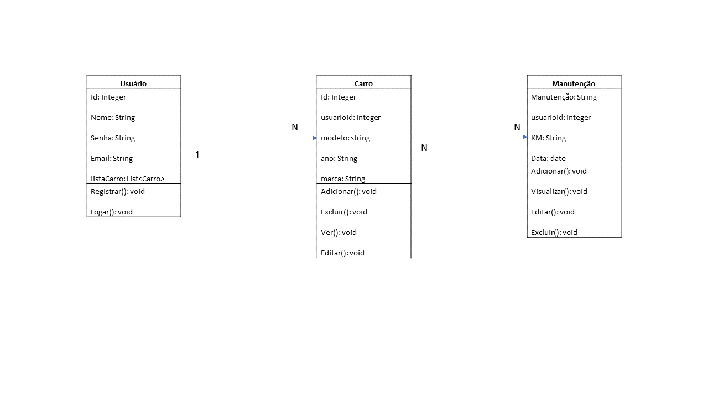
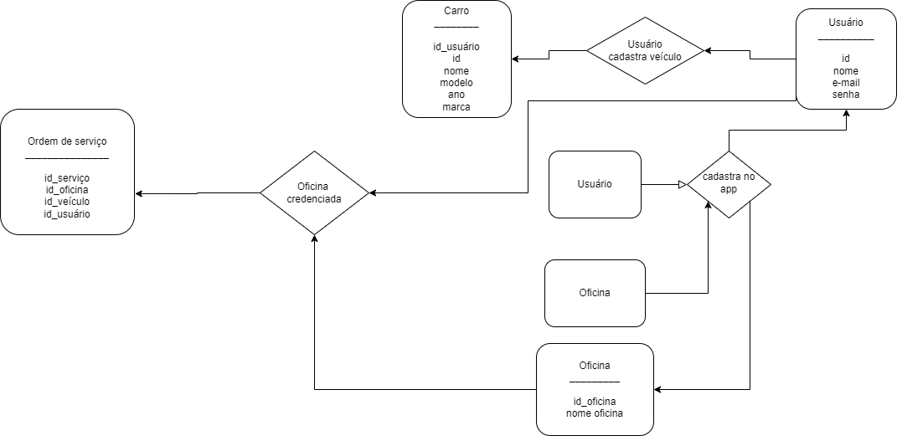
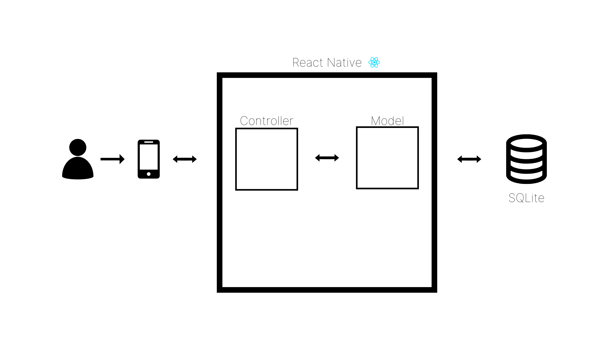
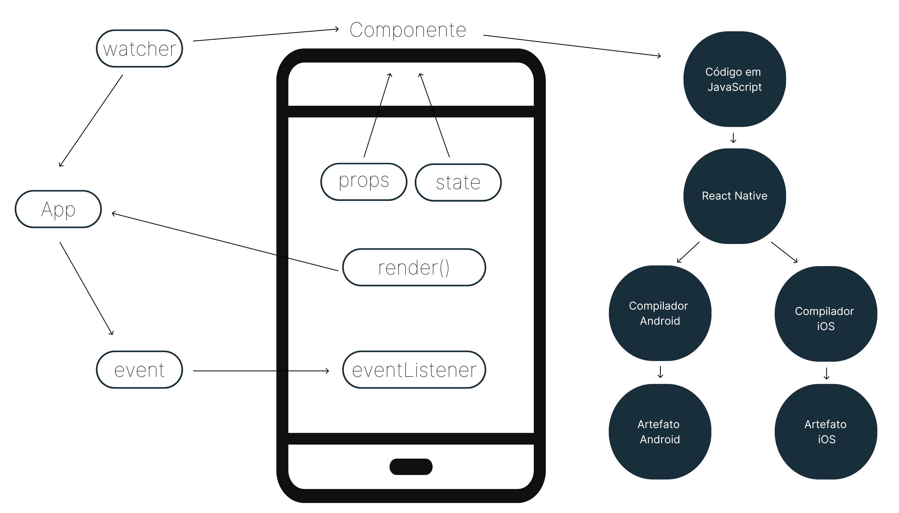

# Arquitetura da Solução

A arquitetura de soluções constrói soluções com base nas necessidades da empresa, é responsável por desenhar e implementar recursos e ferramentas de TI para atender as necessidades do usuário, ou seja, definir de forma estruturada quais são so componentes, propriedades e documentações necessárias para que um sistema seja desenvolvido, além de seu relacionamento com outros sistemas.

A arquitetura para a solução em questão será basicamente a hospedagem da aplicação, e integração da mesma com APIs públicas, a fim de agilizar o processo de login e contatos.

Toda codificação é armazenada no Github, o versionamento é controlado via Git Flow, para que todo o processo seja acompanhado e revertido, se preciso for.

A aplicação do projeto matriz tem integração com banco de dados.

## Diagrama de Classes

O diagrama de classes abaixo representará as classes, suas estruturas e relações que servem de modelo para objetos.

O projeto comtempla o CRUD ou seja, as quatro operações básicas utilizadas em bases de dados relacionais (Create, Read, Update e Delete).

## Modelo ER

O Modelo ER representa através de um diagrama como as entidades (coisas, objetos) se relacionam entre si na aplicação interativa.]

## Esquema Relacional

O Esquema Relacional corresponde à representação dos dados em tabelas juntamente com as restrições de integridade e chave primária.
 

## Modelo Físico

Entregar um arquivo banco.sql contendo os scripts de criação das tabelas do banco de dados. Este arquivo deverá ser incluído dentro da pasta src\bd.

## Tecnologias Utilizadas

Neste projeto, utilizamos o [React](https://pt-br.reactjs.org/) / [React Native](https://reactnative.dev/), uma biblioteca escrita utilizando a linguagem JavaScript para criar interfaces componentizadas e reutilizáveis.  

Utilizamos também o [Expo](https://expo.dev/) para, principalmente, construir (_buildar_) a aplicação para diferentes dispositivos Android e IOS, sem a necessidade de utilizar ambientes de desenvolvimento especializados, como o Android Studio e o XCode. 

Para testar a aplicação de forma nativa, utilizamos o Expo Go direto dos celulares que o grupo tem em mãos.

Usamos o [React Native Paper](https://callstack.github.io/react-native-paper/), uma coleção de componentes já prontos para uso.

O IDE de desenvolvimento será o [Visual Studio Code](https://code.visualstudio.com/).

Para o design das telas, utilizamos o [Figma](https://www.figma.com/).

## Hospedagem

A hospedagem da aplicação será feita no site [Vercel](https://vercel.com/dashboard).

## Qualidade de Software

Conceituar qualidade de fato é uma tarefa complexa, mas ela pode ser vista como um método gerencial que por meio de procedimentos disseminados por toda a organização, busca garantir um produto final que satisfaça às expectativas dos stakeholders.

No contexto de desenvolvimento de software, qualidade pode ser entendida como um conjunto de características a serem satisfeitas, de modo que o produto de software atenda às necessidades de seus usuários. Entretanto, tal nível de satisfação nem sempre é alcançado de forma espontânea, devendo ser continuamente construído. Assim, a qualidade do produto depende fortemente do seu respectivo processo de desenvolvimento.

Com isso, as normas de qualidade ajudam desenvolvedores a criarem softwares com as características ideais de qualidade. Segundo Zanin et al. (2018), as normas de qualidade ajudam os desenvolvedores a criarem softwares com as características ideais de qualidade.

A norma internacional ISO/IEC 25010, que é uma atualização da ISO/IEC 9126, define oito características e 30 subcaracterísticas de qualidade para produtos de software. 

Com base nessas características e subcaracterísticas segue abaixo as que foram escolhidas para nortear o desenvolvimento projeto do AutoApp Mobile, bem como a justificativa e métricas que permitirão à equipe avaliar os objetos de interesse. 

**Segurança**:

- Confidencialidade: *A aplicação garante a confidencialidade dos dados? Sim e Não.*

- Integridade: *A aplicação garante a integridade dos dados? Sim e Não.*

**Usabilidade**:

- Apreensibilidade: *É fácil aprender a utilizar a aplicação? Sim e Não.*

- Operacionalidade: *É fácil de operar e controlar a funcionalidades da aplicação? Sim e Não.*

- Estética da interface: *A aplicação possui interface atual? Sim e Não.*

- Inteligibilidade: *A interface é de fácil entendimento? Sim e Não*

**Portabilidade** :

- Adaptabilidade: *O sistema esta adaptado a Android e IOS? Sim e Não.*

- Facilidade de para ser instalado: *É fácil instalar a aplicação em outros ambientes? Sim e Não.*

- Conformidade: *O sistema apresenta aderência a padrões de portabilidade? Sim e Não*

**Confiabilidade** :

- Maturidade: *Com que frequência a aplicação apresenta falhas? Sempre, As vezes e Nunca.*

- Recuperabilidade: *A aplicação é capaz de recuperar dados após uma falha? Sim e Não.*

- Tolerância a falhas: *A aplicação reage bem às falhas que aparecem? Sim e Não*

**Eficiência** :

- Tempo: *Mínimo tempo de resposta? Sim e Não. Máxima velocidade de execução? Sim e Não*

- Recursos utilizados: *Mínimo uso de recursos para o mesmo resultado? Sim e Não*

**Manutenibilidade** :

- Modificabilidade: *Há facilidade em modificar o código? Sim e Não*

- Testabilidade: *Há facilidade de testar a aplicação? Sim e Não*

A qualidade no ciclo de vida do software  consiste em todas as etapas que o produto passará, desde os primeiros passos, na elicitação de requisitos, até o fim do uso do produto, seguindo o seguinte ciclo: Implementa requisitos, valida, verifica necessidades, implementa necessidade, valida e verifica novamente. Segundo o modelo da ABNT 13596:

